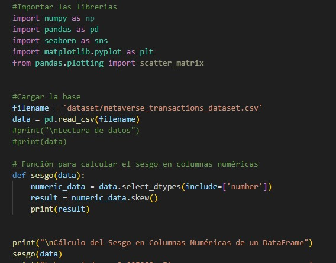
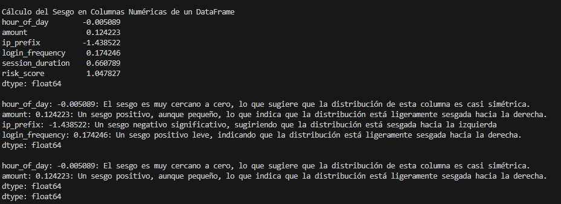
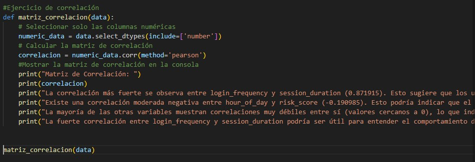
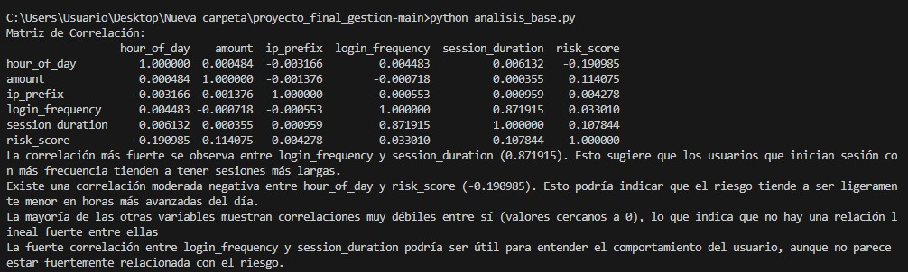

# Proyecto Final Gestión

Breve descripción de lo que hace tu proyecto.

## Requisitos

Lista de requerimientos necesarios para ejecutar tu proyecto.

- Python 3.x
- Pandas
- Otros paquetes necesarios

## Instituto Quito


## Análisis Dataset

### Sesgo

**SESGO**




### MATRIZ DE CORRELACIÓN

**CORRELACIÓN**




**GRÁFICA DE CORRELACIÓN**


**RESUMEN GENERAL DEL DATASET**


**TIPOS DE DATOS**


**DIMENSIÓN DEL DF**


## GRÁFICAS 


### Cargar los datos y función de matriz de densidad

```python
import pandas as pd
import matplotlib.pyplot as plt

# Cargar los datos
filename = 'dataset/metaverse_transactions_dataset.csv'
data = pd.read_csv(filename)

# Función matriz densidad
def matriz_densidad():
    
    # Código básico para gráficar
    figura = plt.figure(figsize=(6,6))
    
    # Código básico para gráficar una matriz de dispersión
    data.plot(kind='density', subplots=True, layout=(3,3), sharex=False)

    #Agregar un título general a la figura
    figura.suptitle("MATRIZ DE DENSIDAD", fontsize=16)

    # Mostrar la figura
    plt.show()

# Llamar a la función 
matriz_densidad()

**MATRIZ DE DENSIDAD**


## Instalación

Pasos para instalar las dependencias y configurar el entorno.

bash
git clone https://github.com/tu-usuario/tu-proyecto.git
cd tu-proyecto
pip install -r requirements.txt
