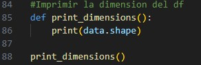
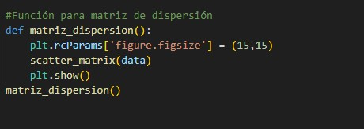

# Proyecto Final Gestión

El proyecto titulado "Detección de Fraude en Transacciones Financieras con Algoritmos de IA" tiene como objetivo desarrollar un sistema eficaz para identificar transacciones fraudulentas utilizando técnicas avanzadas de inteligencia artificial. Este proyecto fue desarrollado en el editor Visual Studio Code, empleando el lenguaje de programación Python.

Para abordar este desafío, se realizaron diversas actividades, incluyendo un análisis exhaustivo de los datos utilizando las bibliotecas como: Pandas, NumPy, Scikit-learn, Matplotlib y Seaborn.. Estas herramientas permitieron una manipulación y exploración detallada de los conjuntos de datos, facilitando la identificación de patrones y anomalías. Además, se implementaron métricas de clasificación y regresión para evaluar el rendimiento de los modelos de detección de fraude. Se generaron diversas gráficas que proporcionaron una representación visual de los datos y los resultados obtenidos, lo que permitió una comprensión más profunda de las tendencias y relaciones presentes en las transacciones financieras.


## Requisitos

### Dataset 

df = pd.read_csv('https://www.kaggle.com/datasets/faizaniftikharjanjua/metaverse-financial-transactions-dataset')

Lista de requerimientos necesarios para ejecutar tu proyecto.


- Python 3.12
- Pandas
- numpy==2.0.0
- pandas==2.2.2
- matplotlib==3.9.0
- scikit-learn==1.5.0
- scipy==1.13.1
- seaborn==0.13.2

```bash
pip install numpy==2.0.0 pandas==2.2.2 matplotlib==3.9.0 scikit-learn==1.5.0 scipy==1.13.1 seaborn==0.13.2
```

## Instituto Quito


## Análisis Dataset

### Sesgo

**SESGO**


### MATRIZ DE CORRELACIÓN

**CORRELACIÓN**


**RESUMEN GENERAL DEL DATASET**


**TIPOS DE DATOS**


**DIMENSIÓN DEL DF**




## GRÁFICAS 


## DIAGRAMA DE CAJA 


**GRÁFICA DE CORRELACIÓN**


**GRÁFICA DE MATRIZ DE DISPERSIÓN**




**MÉTRICAS DE CLASIFICACIÓN**


**MÉTRICAS DE REGRESIÓN**


## AUTORES

Camila Landy
Richard Landy 

