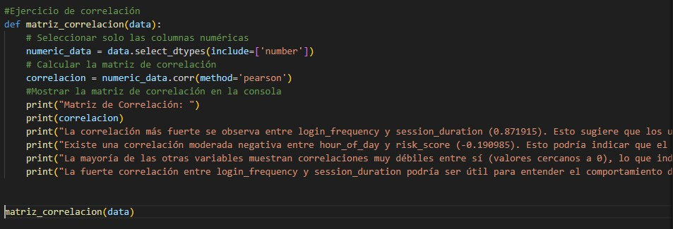

# Proyecto Final Gestión

Breve descripción de lo que hace tu proyecto.

## Requisitos

Lista de requerimientos necesarios para ejecutar tu proyecto.

- Python 3.x
- Pandas
- Otros paquetes necesarios

## Instituto Quito


## Análisis Dataset

### Sesgo

**SESGO**


### MATRIZ DE CORRELACIÓN

**CORRELACIÓN**




## Instalación

Pasos para instalar las dependencias y configurar el entorno.

```bash
git clone https://github.com/tu-usuario/tu-proyecto.git
cd tu-proyecto
pip install -r requirements.txt
